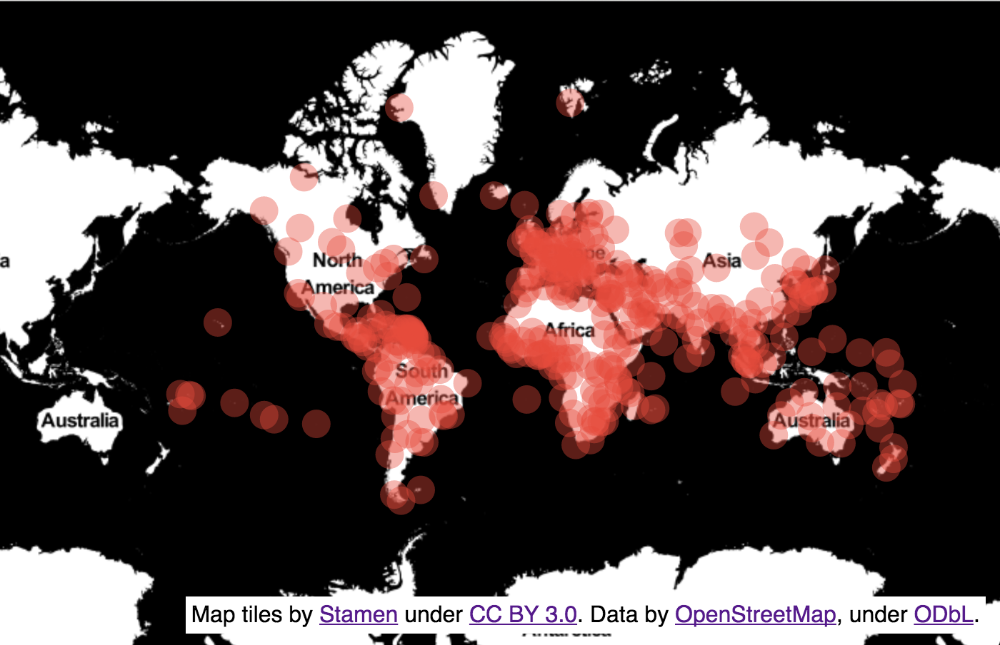

# react-map-gl-example-overlay

An example of a standalone react-map-gl-overlay. Use it as a starting point for
creating your own custom overlay.



## Usage

````js
var ExampleOverlay = require('react-map-gl-example-overlay');
var cities = require('example-cities');
````

Where each element in `cities` has the form: `{latitude, longitude}`.

````js
    render() {
      var {viewport} = this.state.viewport;
      return <MapGL {...viewport}>
        <ExampleOverlay {...viewport} locations={cities} />
      </MapGL>;
    }
````

